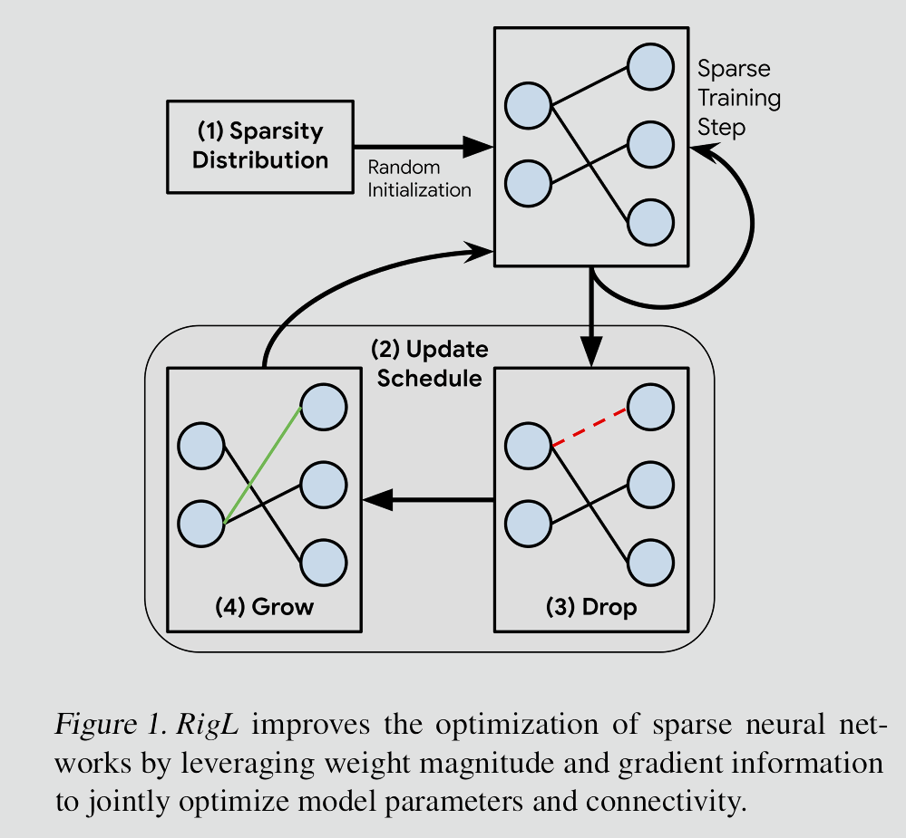
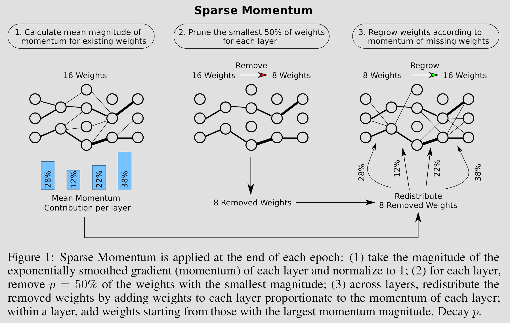
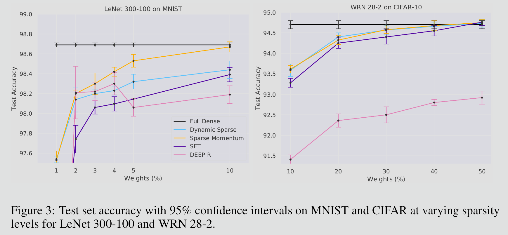
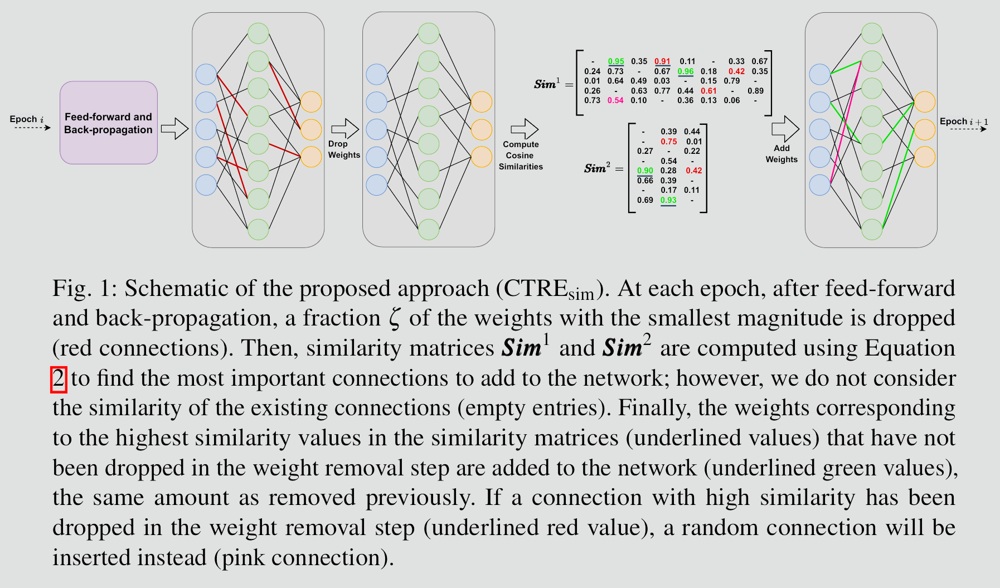
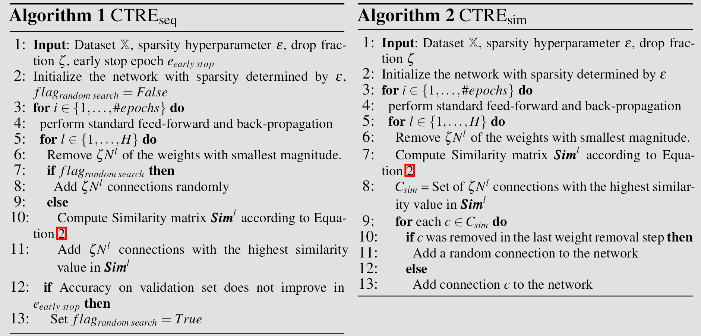
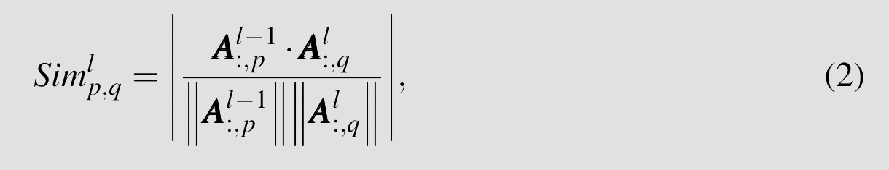
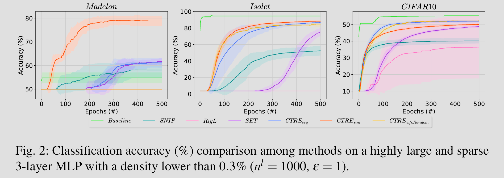
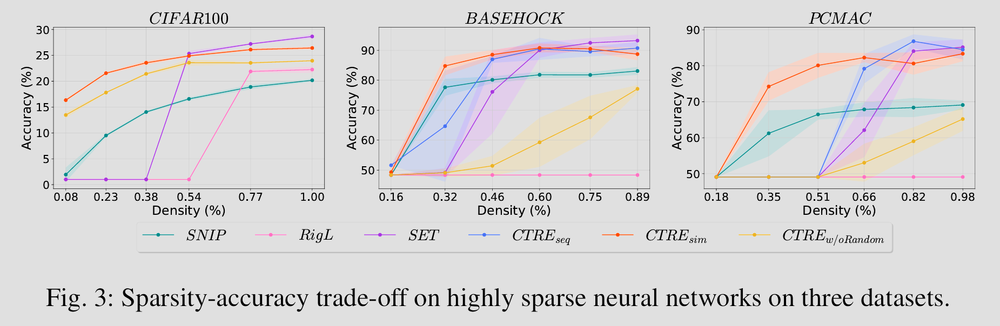

**AIs today are still so Dense! I mean it metaphorically and literally.**

This is largely because the pervasive belief in deep learning has long been that "bigger is better." Dense, over-parameterized neural networks, with their millions or even billions of connections, have consistently delivered state-of-the-art performance across a myriad of tasks. However, this success comes at a significant cost: immense computational resources, high memory consumption, and slow inference times. The "sparse revolution" seeks to challenge this paradigm, demonstrating that powerful performance can be achieved with only a fraction of these connections. The ultimate prize in this revolution is the ability to train these sparse networks from scratch, bypassing the need for an expensive dense training phase.

**By the end of this article, you will** have a solid understanding of the most tried and trusted pruning and growth methods, how to use them to train sparse networks from scratch, understand exact reasons why they can work efficiently and at all, and gain some crucial insights for the development of superior learning algorithms and model architectures.

## The Art of Sculpting: Unstructured Pruning and Growth Methods

The journey towards efficient sparse networks often involves a delicate dance between removing superfluous connections (pruning) and introducing new, potentially beneficial ones (growth). These unstructured methods aim to discover optimal sparse connectivity patterns that maximize performance while minimizing computational overhead. To provide a structured understanding, these methods are classified by the order of derivative information they utilize: zeroth-order (relying solely on weight values or heuristics without derivatives), first-order (incorporating gradients or first derivatives for dynamic assessment), and second-order (using Hessian matrices or second derivatives for curvature-aware decisions). This classification, drawn from comprehensive surveys and empirical studies, highlights trade-offs in complexity, precision, and scalability. Zeroth-order methods are simple but less adaptive, first-order offer a balance with gradient-driven insights, and second-order provide theoretical rigor but at higher computational expense.

### Unstructured Pruning Methods

Unstructured pruning techniques eliminate individual weights without imposing constraints on the resulting network structure. This allows for maximum flexibility in achieving high sparsity, but it can make hardware acceleration challenging due to irregular memory access patterns. Classifications by order enable targeted application: zeroth-order for quick, data-free pruning; first-order for adaptive, high-sparsity scenarios; and second-order for precise, loss-minimizing removals.

- Zeroth-Order Pruning Methods: These rely on weight magnitudes or statistical measures without gradient information, making them computationally lightweight and suitable for post-training compression.
    - Magnitude Pruning (Zeroth-Order Method): This is the simplest and most widely used pruning technique. After a dense network is trained, weights with the smallest absolute values are removed. The intuition is that weights closer to zero contribute less to the network's output and are thus less important. Iterative magnitude pruning (IMP), as explored in the "Lottery Ticket Hypothesis," involves repeatedly training, pruning, and resetting remaining weights. Examples include pruning below a threshold, often with retraining to recover accuracy, achieving compressions like 35x for AlexNet on ImageNet without loss.
        - How it works:
            1. Train a dense network to convergence.
            2. Prune a fixed percentage of weights with the smallest magnitudes (e.g., global or layer-wise thresholds).
            3. Retrain the remaining sparse network.
            4. (Optional for IMP) Reset the remaining weights to their initial values and repeat.
        - Advantage: Simple implementation, effective for moderate sparsity (up to 90%), no need for gradients.
        - Disadvantage: May remove important weights at high sparsity (>90%), less adaptive in transfer learning as it ignores training dynamics.
    - Other Zeroth-Order Examples: Neuron similarity pruning merges similar-output neurons (Srinivas and Babu, 2015), coreset pruning removes redundant subsets (Mussay et al., 2020), and activity/correlation-based methods eliminate low-variance activations (Sietsma and Dow, 1988, 1991; Suau et al., 2019).
- First-Order Pruning Methods: These leverage gradients (first derivatives of the loss) to assess weight importance, enabling more informed, data-driven pruning that adapts during training.
    - Gradient-Based Pruning (e.g., SNIP - Single-shot Network Pruning): Prunes based on sensitivity scores like |∂L/∂w| * w, removing weights with minimal loss impact in a single pass before full training.
        - How it works:
            1. Compute gradients on a small batch (e.g., batch size equal to classes).
            2. Calculate importance as |g_w * w| or variants like GraSP (preserving gradient flow: δ_w H g_w).
            3. Prune lowest-scoring weights iteratively or in one shot.
            4. Train the sparse network from scratch.
        - Advantage: Better at high sparsity (95%+), improves generalization by considering data influence.
        - Disadvantage: Requires gradient computations, though reusable from training.
    - Movement Pruning: A deterministic first-order method that prunes based on weight movements during fine-tuning, using scores S = -α ∑ (∂L/∂W) W over updates, outperforming magnitude at high sparsity (e.g., 76.3 F1 vs. 54.5 on SQuAD at 3% weights).
        - How it works: Accumulate movements away from zero; use straight-through estimator for gradients through masks.
    - Momentum-Based Pruning: Tracks weight magnitudes over epochs (e.g., last 15) using momentum from SGD, pruning consistently low ones; accounts for layer importance via I(W_l) = W_l / W_avg.
        - How it works: Prune if below threshold for 10-15 epochs; achieves 15x compression on VGG16 with minimal accuracy drop on CIFAR-10.
    - Other First-Order Examples: Sensitivity analysis (Engelbrecht and Cloete, 1996), gating functions (Mozer and Smolensky, 1988), and first-order Taylor expansion (Molchanov et al., 2017).
- Second-Order Pruning Methods: These use the Hessian matrix for curvature information, estimating loss changes via second-order Taylor expansions to identify redundant weights more accurately.
    - Hessian-Based Pruning (e.g., Optimal Brain Damage/Surgeon - OBD/OBS): Prunes weights with small eigenvalues or low sensitivity in the inverse Hessian, minimizing loss increase.
        - How it works:
            1. Compute or approximate the Hessian matrix of the loss with respect to the network weights (e.g., diagonal approximations for scalability).
            2. Identify weights whose removal would lead to the smallest increase in the loss, often by considering their contribution to the change in loss based on second-order Taylor expansion (e.g., δL ≈ (1/2) w^T H w for pruned w).
            3. Prune these less sensitive weights and optionally retrain.
        - Advantage: More theoretically grounded and can be more effective at identifying truly redundant parameters, especially in low-data regimes.
        - Disadvantage: Computationally much more expensive to compute and invert the Hessian, limiting its scalability to very large networks; approximations like KFAC or WoodFisher help but add overhead.
    - Other Second-Order Examples: SparseGPT scales second-order to LLMs by pushing gradients toward zero; entropy-guided pruning (EGP) uses information theory alongside Hessians.

### Unstructured Growth Methods

While pruning removes connections, growth methods introduce them, often in conjunction with pruning to maintain a target sparsity level. This allows the network to adapt its connectivity during training, evolving topologies that can outperform static sparse ones. Classifications mirror pruning: zeroth-order for random addition, first-order for gradient-guided growth, and second-order for curvature-based, though the latter is rarer due to complexity.

- Zeroth-Order Growth Methods: These add connections based on heuristics or randomness, without derivative information, for simplicity in dynamic training.
    - Random Growth: Adds new weights randomly to masked positions, often to replace pruned ones, maintaining sparsity.
        - How it works:
            1. During training, select random zeroed positions.
            2. Initialize new weights (e.g., small random values).
            3. Pair with pruning to keep constant sparsity.
        - Advantage: Extremely simple, no extra computations.
        - Disadvantage: Less targeted, may add irrelevant connections, underperforming at high sparsity.
    - Magnitude-Based Growth: While often zeroth-order in pruning, for growth it can estimate where large magnitudes would emerge, re-adding previously pruned positions based on heuristics.
- First-Order Growth Methods: These use gradients to identify promising positions for new connections, enabling adaptive sparsity during training.
    - Gradient-Based Growth: More sophisticated growth methods consider the gradients of the loss with respect to the potential connections (i.e., connections that are currently zero or non-existent). Connections with the largest gradients indicate positions where adding a weight would most significantly reduce the loss.
        - How it works:
            1. During training, calculate gradients for all current and potential weights (e.g., via masks).
            2. Select a fixed percentage of potential weights with the largest gradients (e.g., |∂L/∂w| for zeroed w).
            3. Initialize these new weights (e.g., to zero or a small random value).
            4. This often happens in conjunction with pruning to maintain a constant sparsity level, leading to dynamic sparse training (e.g., RigL, SET).
        - Advantage: Targets loss-reducing additions, better performance in sparse-from-scratch training.
        - Disadvantage: Requires tracking gradients for masked weights, increasing memory slightly.
    - Momentum-Based Growth: Extends momentum from pruning to growth, adding weights where accumulated gradients suggest persistent importance.
- Second-Order Growth Methods: Rare but use Hessian info to add connections where curvature indicates high potential impact.
    - Hessian-Guided Growth: Adds weights in directions of high Hessian eigenvalues, approximating where second-order effects would benefit.
        - How it works: Similar to pruning but inverse—add where removal would hurt most, using approximations for scalability.
        - Advantage: Precise for complex models.
        - Disadvantage: High cost, limited to small networks.

The following table summarizes key comparisons across orders for both pruning and growth:

| Order | Pruning Examples | Growth Examples | Key Advantages | Key Disadvantages | Typical Sparsity Range | Benchmarks (e.g., Accuracy Retention) |
| --- | --- | --- | --- | --- | --- | --- |
| Zeroth | Magnitude, Neuron Similarity | Random, Magnitude-Based | Simplicity, Low Compute | Less Adaptive, Poor at High Sparsity | 0-90% | ImageNet: No loss at 90% for AlexNet |
| First | SNIP, Movement, Momentum-Based | Gradient-Based, Momentum-Based | Data-Driven, High Sparsity Performance | Gradient Overhead | 90-99% | SQuAD: 79.9 F1 at 3% weights (Movement) |
| Second | Hessian-Based (OBD/OBS), SparseGPT | Hessian-Guided | Theoretical Precision | High Computational Cost | 70-95% | LLMs: Scales to billions of parameters |

## Dynamic Sparse Training : Pruning & Growth at Training time

### **The Challenge of Training Sparse Networks from Scratch**

- **Dead Neurons & Weights:** Randomly initialized sparse connections might prevent gradients from flowing effectively, leading to "dead" neurons or paths that never learn.
- **Lack of Exploration:** A fixed sparse mask might restrict the network from finding optimal connection patterns. The network might get stuck in a poor local minimum.
- **Initial Instability:** Starting with a sparse network could make training unstable due to the limited number of active connections to learn from the initial noisy gradients.

### **How to Addresses These Challenges**

The tried and trusted methods for training unstructured sparse networks from scratch are almost always through a iterative neuron/weights pruning and regrowth process.

For example, the papers like “[**Rigging the Lottery: Making All Tickets Winners**](https://arxiv.org/abs/1911.11134)” or **"[Sparse Networks from Scratch: Faster Training without Losing Performance](https://arxiv.org/abs/1907.04840)",** latter introduced **Sparse Momentum** as a key mechanism for successfully training sparse networks from scratch.

Sparse Momentum works by intelligently managing both the active weights and the momentum associated with inactive (pruned) weights. 

Instead of a fixed mask, Sparse Momentum employs a dynamic sparse training approach. During training, it periodically prunes the weakest active weights (e.g., those with smallest magnitudes) and grows new connections in potentially more promising locations (e.g., where their gradients are largest). This allows the network to constantly adapt and explore the vast space of possible sparse connectivity patterns.

- **Why this works:** It prevents the network from getting stuck with a suboptimal initial sparse mask. If a connection is initially pruned but later becomes important, the growth mechanism can reintroduce it. This continuous refinement ensures that the network finds a high-quality sparse subnetwork.
- **Inactive Weights Momentum based Regrowth:** This is the crucial mechanism. Standard optimizers like SGD with Momentum or Adam typically only update the momentum for *active* weights. Sparse Momentum, however, maintains and updates momentum for *all potential weights*, including those that are currently zero or pruned. The mechanism works as follow:
    1. Imagine a weight `w_ij` that is currently pruned (i.e., `w_ij = 0`). Even though it's zero, its *gradient* `∇L/∇w_ij` can still be computed. Sparse Momentum accumulates a running average of this gradient (its momentum `m_ij`) *even when the weight itself is inactive*.
    2. When the network decides to *grow* new connections, it preferentially chooses those with the largest accumulated momentum `m_ij`. This means that connections that have consistently shown a strong gradient signal – indicating that they *should* be active to reduce the loss – are more likely to be selected for growth.
    3. When a new connection is grown, it's not initialized randomly or to zero, but often *infused* with its accumulated momentum. This gives the newly activated connection a "head start" and a more informed initial direction, preventing it from being a "dead" connection. It leverages past gradient information even for connections that weren't actively participating.

Methods like Sparse Momentum allows the network to:

- **Solve Dead Neurons & Weights issue** since weights that are useless gets pruned
- **Intelligently explore the sparse landscape:** Through their accumulated momentum for inactive weights, guiding the growth process to truly promising pathways.
- **Bootstrap newly grown connections:** By initializing weights them with informed momentum, leading to more stable and effective learning from scratch.

**One critical problem of those gradient-based dynamic sparse training algorithms is the high computational cost due to dense gradient calculation for all non-existing connections.**

Both algorithms using **Zeroth-ordered growth method** like SET (Sparse Evolutionary Training) which uses relying on pure **random weight addition or First & Second ordered growth methods** are struggle to find a good sub-network because the search space becomes too large in high sparsity scenarios

A paper **“A Brain-inspired Algorithm for Training Highly Sparse Neural Networks”** introduced a novel method called **Cosine similarity-based and Random Topology Exploration (CTRE)** to solve those issue

CTRE's training loop follows these steps per epoch, after standard feed-forward and back-propagation with SGD (momentum and L2 regularization):

1. **Magnitude-Based Pruning**: Identify and remove ζNl weights (where ζ is the pruning fraction, Nl the layer parameters) with the smallest absolute magnitudes. This step, inspired by brain synapse shrinkage during sleep, ensures ongoing sparsity and eliminates weak connections that contribute minimally to outputs.
2. **Topology Evolution (Growth Phase)**: Add an equal number of new connections to replace pruned ones, using a hybrid of cosine similarity and random strategies. New weights are initialized from a small uniform distribution (e.g., U(−0.1,0.1)).
    - **Cosine Similarity-Based Topology Exploration:** Rooted in Hebbian theory, use the cosine similarity as a metric to derive the importance of non-existing connections and evolve the topology of a sparse neural network, it measures correlation of two neurons via activations from a mini-batch between consecutive layers.
        
        
        
        - Use the cosine similarity instead of dot product to make the metric insensitive to the features’ magnitude, this makes it more robust in noisy environments, since those noise may bias the growth policy toward neurons with very high activation magnitudes, even if those neurons correspond to uninformative or noisy features, causing the algorithm to get stuck in a poor local minimum
        - Very similar to switch connections for maximizing mutual information in paper **“[Unsupervised representation learning with Hebbian synaptic and structural plasticity in brain-like feedforward neural networks](https://www.sciencedirect.com/science/article/pii/S0925231225001122)”**
    - **Random Topology Exploration:** Cosine similarity can stabilize too early, limiting discovery. Random exploration injects stochasticity, akin to brain neurogenesis, by selecting unconnected neuron pairs uniformly at random.
3. **Repeat**: Continue for up to 500 epochs or until validation accuracy converges, with the topology adapting dynamically—no fixed masks, allowing full exploration.

Methods like CTRE enables sparse-from-scratch training that leverages local later/neuron information to removing the reliance on dense gradient calculation and complete random exploration all while not sacrificing performance providing better research directions for future work

## The Future of the Sparse-land

I’ll just save all the talk for the obvious benefits of training a sparse neural network from scratch, i.e., computation & memory save, robustness against noise & overfitting, etc. Instead, I want to extend on some less considered aspects.

### Better Representation Learning

All the methods described so far are only focused on connections/weights sparsity, but one can imagine couple those techniques with methods for neuron activation sparsity, we could achieve more robust & well factored  latent representations in a way that is closer resemble the kind of sparse neuron representations in biological brains, and so we can replace the current most commonly used dense latent representations which shares the same vector space makes them inevitably fractured & entangled

### Better Continual Learning

If we extrapolate one step further, then we will realize that robust & well factored latent representations are essential not only for any underlying tasks, but most importantly, the ability to learn continuously from noisy input data stream without forget the important old knowledges while acquiring new knowledges at a increasingly faster efficiency, i.e., like how human & animal learn to stack up our knowledge hierarchy piece by piece.

### Better Learning Algorithm

Assume we do have the robust & well factored latent representations in a sparse neural network, we would still have critical problems when trying to make it learn continuously in that ideal way we just described, this is because the Gradient Decent with Backpropagation algorithm will trying to modify as many connections as it can to best solve the task at the current learning step, regardless of the importance of the connections for the other tasks the network already learned, a good sparse representations the network have can indeed largely mitigate this issue, but as long as there are weights sharing across different inputs/tasks, then we’ll very likely still have this issue.

**It is my current firm belief that we’ll need a better learning algorithm that leverage the brain-inspired sparse local learning rules together with global dopaminergic reward signal to achieve the true Agile Machine Intelligence (prefer calling it AMI instead of AGI)**

## Onto the Next Page

That’s all for this article, next I’ll start to explore more about those future promising directions I mentioned and maybe the mystery of why those very wide & depth random sparse neural network worked unreasonable well compared to same but dense trained network, like networks used in reservoir compute, mind boggling.

Thanks for reading until the end, but the joy of science is the endless explorations and discoveries, in fact I’m just getting started! I don’t know how far this journey to build AMI will take me, I don’t even know if I can achieve anything significant, I just know I won’t give up, because as far as I see, there is no greater adventure for a man’s life, 3 years, 5 years or even a few decades, so be it!