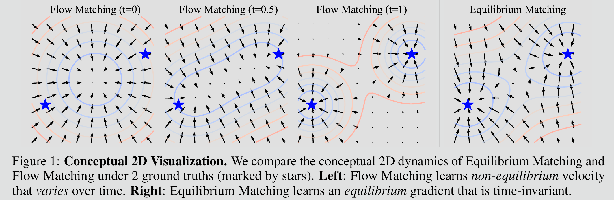
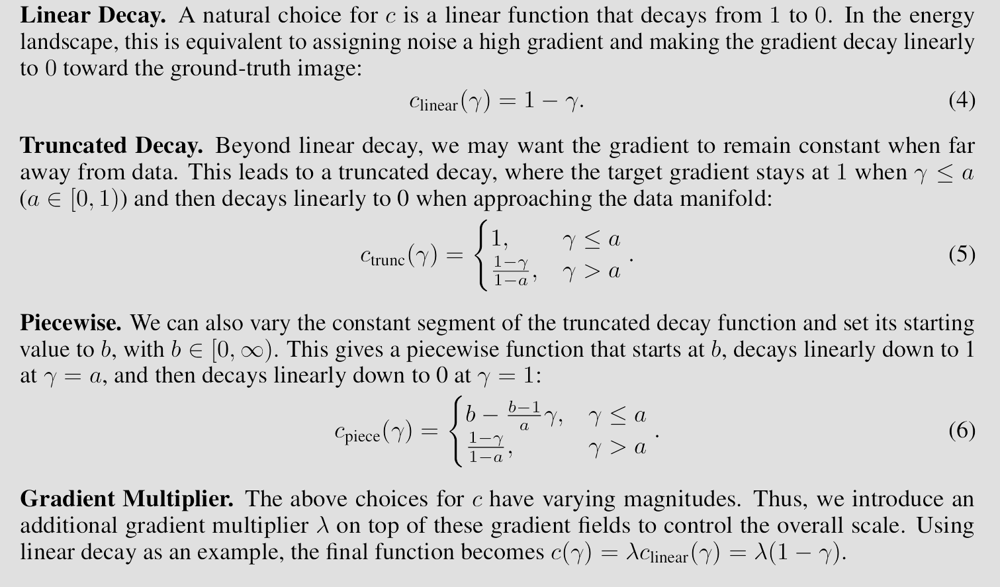
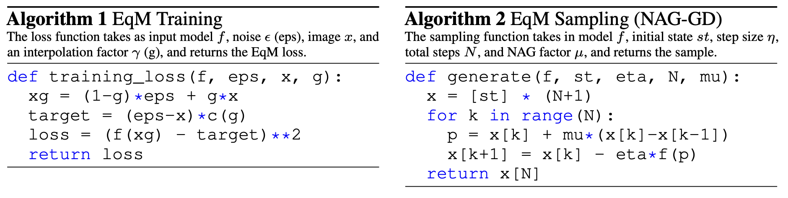
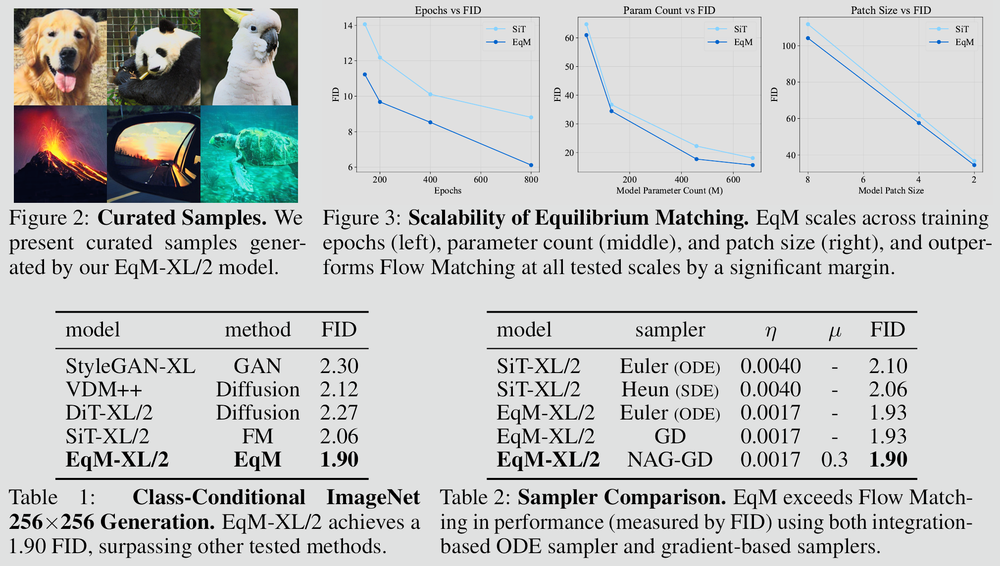
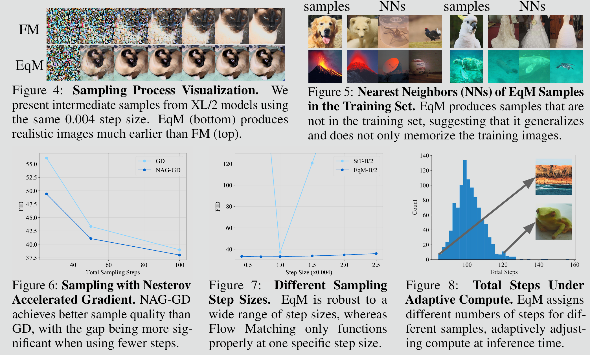
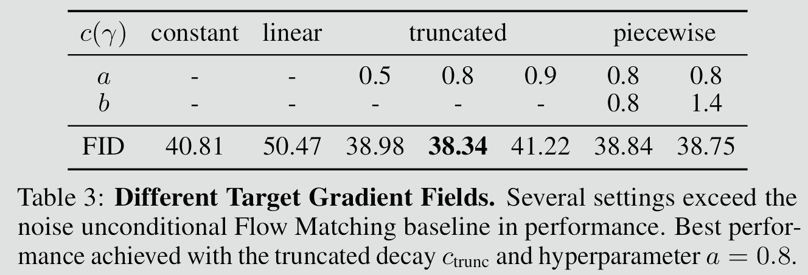
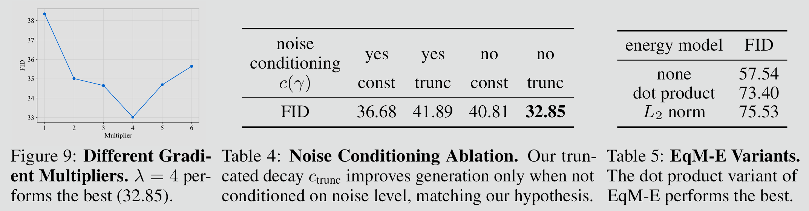
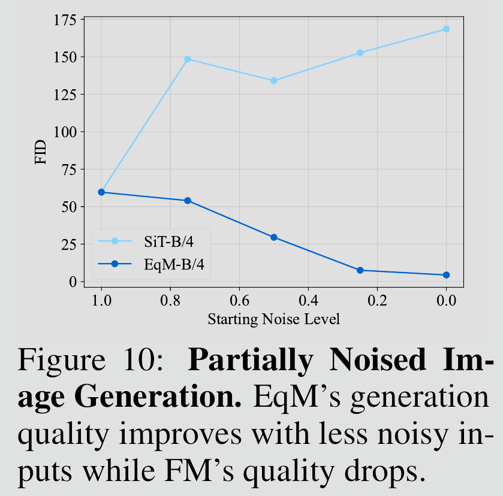
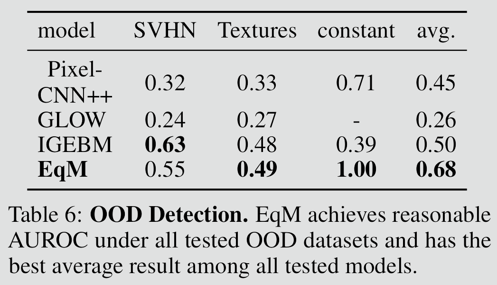
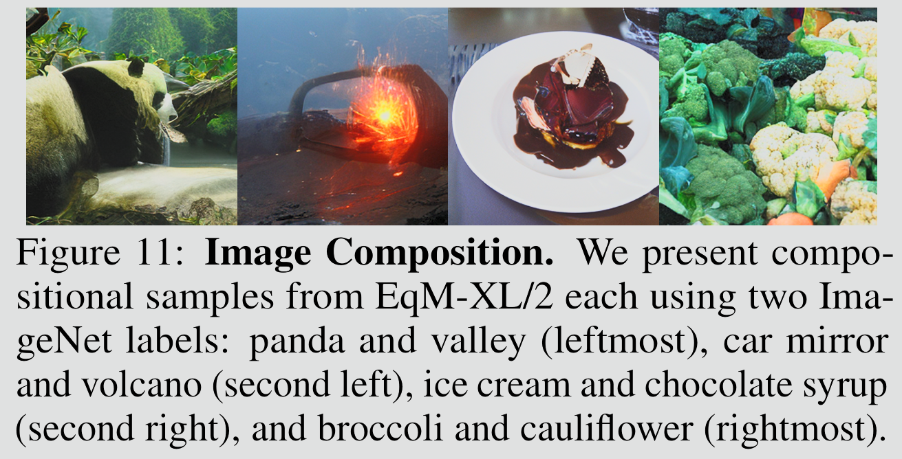

### Key Takeaways

From now on, when trying diffusion model, use Equilibrium Matching (EqM) to learn the equilibrium (static) gradient of an implicit energy landscape instead of using Flow Matching learns non-equilibrium velocity field that varies over time

   <video controls autoplay loop src="https://github.com/user-attachments/assets/597807a0-7c25-4a23-b573-baf0f0796c1d"></video>

### Methods

- **Flow Matching (FM)**
    - $L_{FM}= (f(x_t,t)−(x−ϵ))^2$
        - $t$ is a timestep sampled uniformly between 0 and 1, $ϵ$ is Gaussian noise,  $x$ is a sample from the training set
    - $L_{uncond-FM}= (f(x_t)−(x−ϵ))^2$
        - This can also learn equilibrium dynamics, but doing so will degrades generation quality

- **Equilibrium Matching (EqM)**
    - $L_{eqM}= (f(x_γ)−(ϵ−x)c(γ))^2$
        - $γ$ is an interpolation factor sampled uniformly between 0 and 1 but unlike $t$ in FM, $γ$ is implicit and not seen by the model, and  $c(γ)$ is a positive constant that controls the gradient magnitude
    
    
    
- **[Optional] Explicit Energy Model**
    - $L_{EqM-E} = (∇g(x_γ) −(ϵ−x)c(γ))^2$
        - $g$ is an explicit energy model that outputs a scalar energy value, there are two ways to construct it from an existing Equilibrium Matching model $f$ without having to introduce new parameters:
            - **Dot Product:** $g(x_γ) = x_γ · f(x_γ)$
            - **Squared L2 Norm:** $g(x_γ) = −1/2||f(x_γ)||^2_2$

- **Sampling with Gradient Descent Optimizers**
    - **Gradient Descent Sampling (GD)**: $x_{k+1} ← x_k −η∇E(x_k)$;
    - **Nesterov Accelerated Gradient (NAG-GD)**: $x_{k+1} ← x_k −η∇E(x_k +µ(x_k −x_{k−1}))$, any other similar optimizer like Adam should also work
    - $E$ may be learned implicitly ($∇E(x) = f(x)$) or explicitly ($∇E(x) = ∇g(x)$)
    - **Sampling with Adaptive Compute**: Another advantage of gradient-based sampling is that instead of a fixed number of sampling steps, we can allocate adaptive compute per sample by stopping when the gradient norm drops below a certain threshold $g_{min}$

### Evaluations
**Main Results:**

**Ablation Study:**
 

**Unique properties of Equilibrium Matching that are not supported by traditional diffusion/flow models:**

- **Partially Noised Image Denoising:** By learning an equilibrium dynamic, Equilibrium Matching can directly start with and denoise a partially noised image.
	

- **Out-of-Distribution Detection:** Can perform out-of-distribution (OOD) detection using energy value, in-distribution (ID) samples typically have lower energies than OOD samples.
	

- **Composition:** Naturally supports the composition of multiple models by adding energy landscapes together (corresponding to adding the gradients of each model).
	
