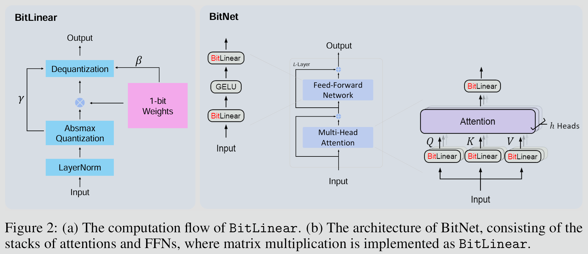
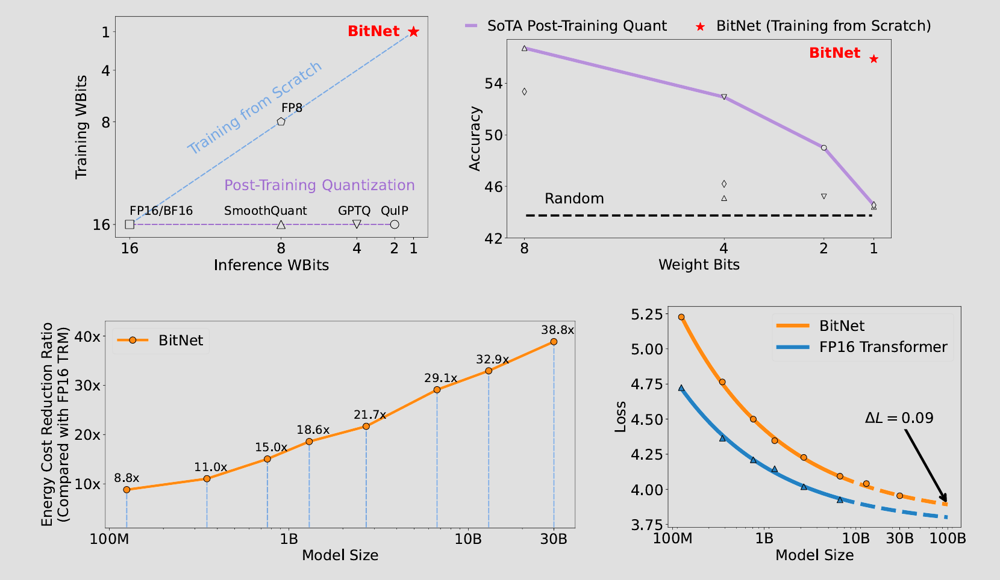
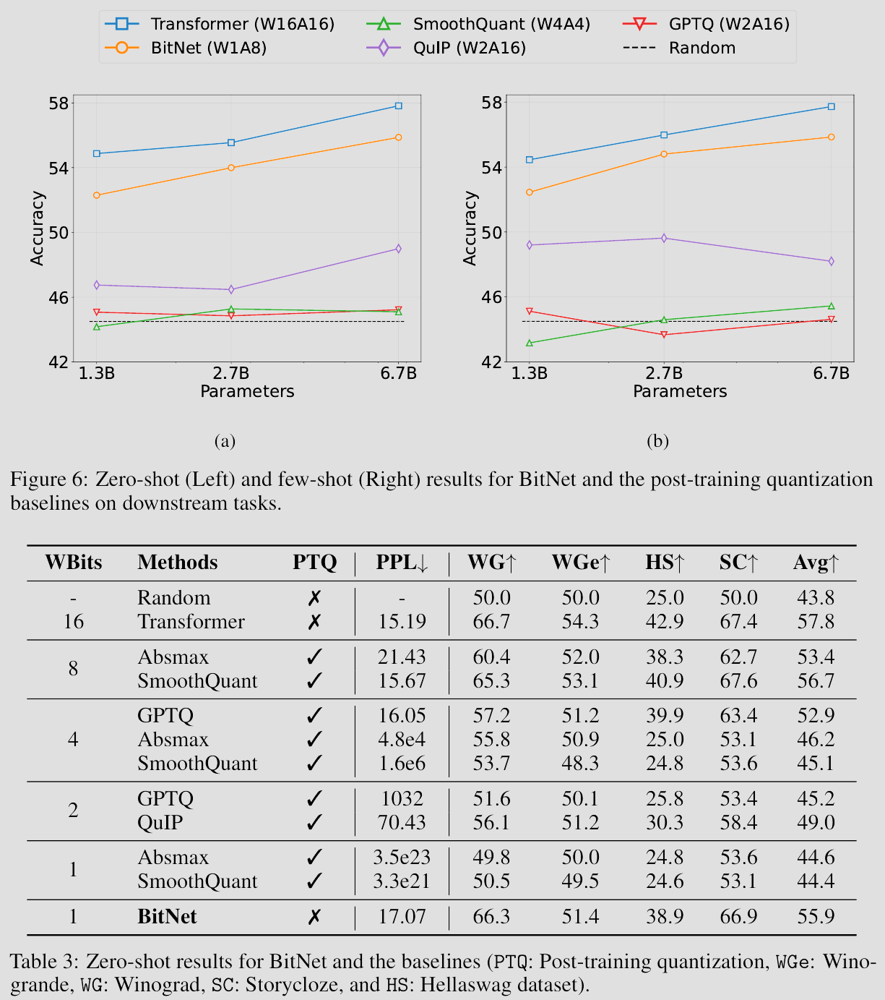
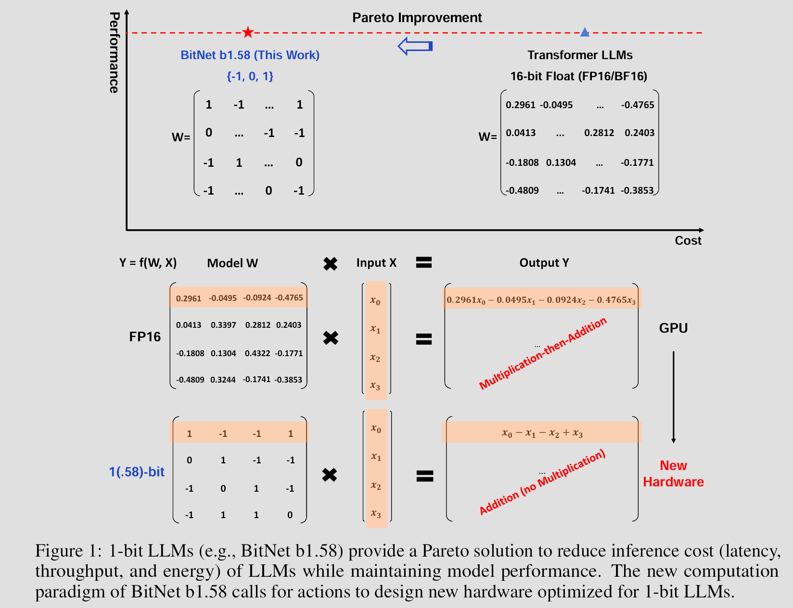
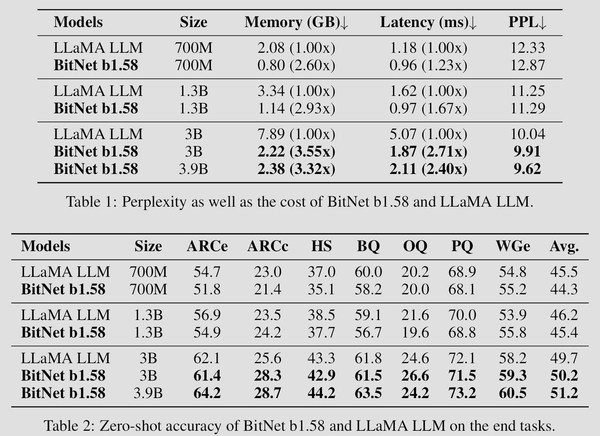
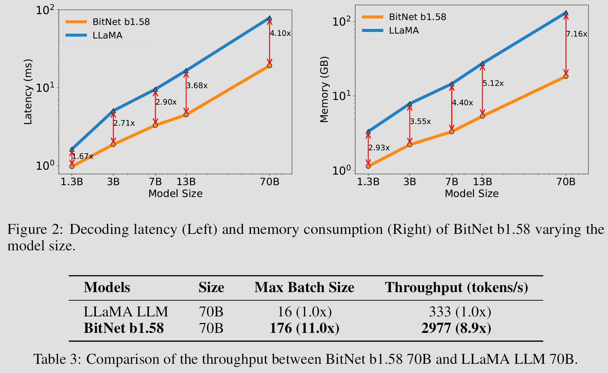
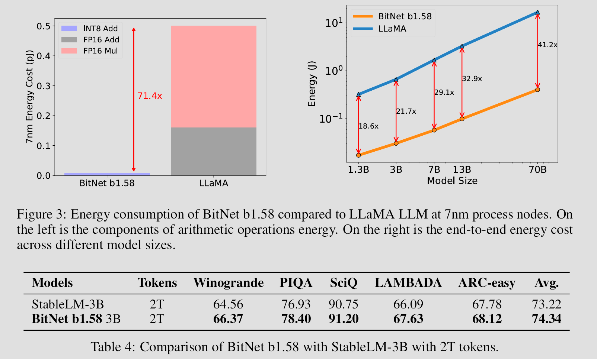
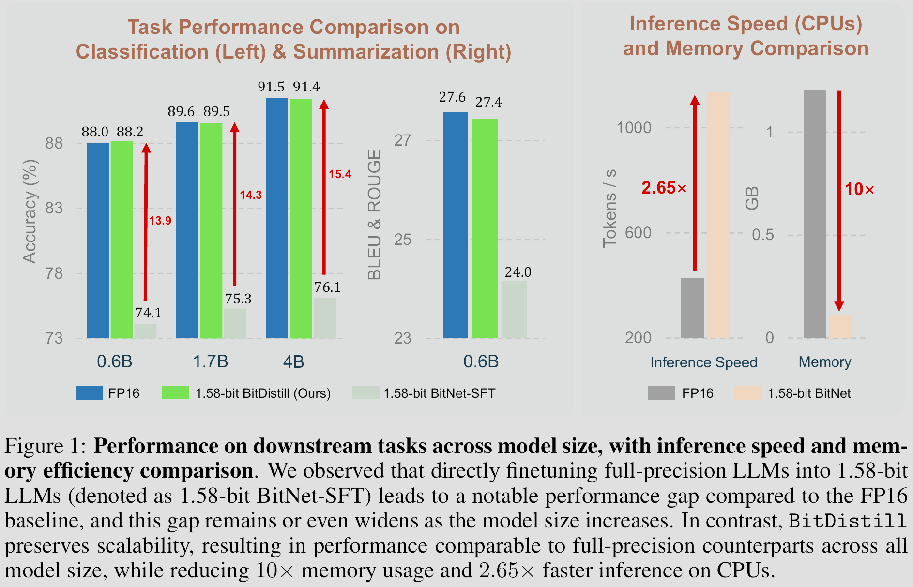
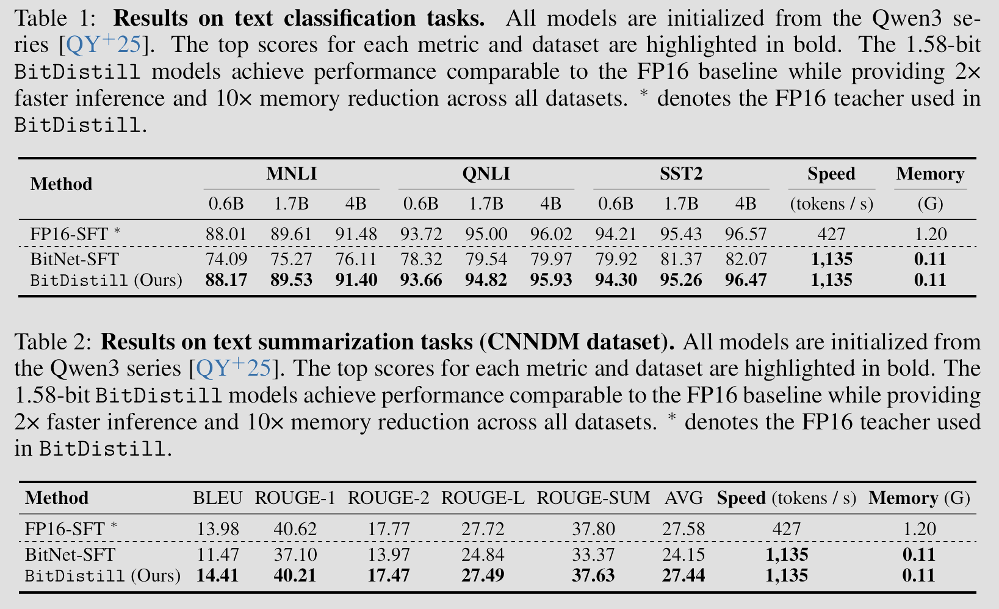
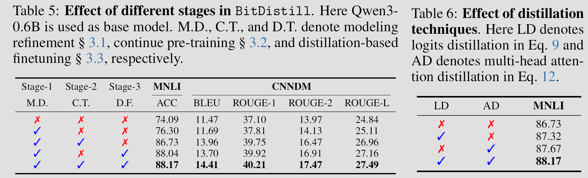

**It is obvious that the increasing size of LLMs has created enormous model deployment and energy consumption problems.**

**We know quantization helps, but how extreme we can take it? How about 1-bit?**

[**BitNet**](https://arxiv.org/abs/2310.11453) is proposed in Oct 2023, it is a scalable and stable 1-bit Transformer architecture that achieves far better memory & computation efficiency while maintain competitive performance when compared to state-of-the-art quantized Transformer baselines (e.g., 8-bit, fp16)

**BitLinear**

- Linear layer with binarized (i.e., 1-bit, either +1 or −1) model weights while leave the other components high-precision
- It implements **SubLN**, i.e., places Layer Normalization (LN) modules inside sublayers of a Transformer architecture, this solved the issues of optimization instability and degraded convergence which are caused by excessively large activation variance
- Quantization of the input activations to b-bit precision (8-bit in [BitNet paper](https://arxiv.org/abs/2310.11453)) uses absmax quantization which scales activations into the range $[−Q_b,Q_b] (Q_b = 2^{b−1})$ by multiplying with $Q_b$ and dividing by the absolute maximum of the input matrix $γ$
- The binarization of a weights can be summarized as centralize the weights to be zero-mean (i.e., weights - weights mean), then set weight values to 1 if weight values > 0; -1 otherwise
- The output activations are rescaled with ${β,γ}$ to dequantize them to the original precision, $β$ is the average absolute value of original weights

**BitNet Training**

- Use **Straight-through estimator (STE)** to by passes the nondifferentiable functions, such as the Sign and Clip thus approximate the gradient during backpropagation
- Use **Mixed precision training** so that the weights and the activations are quantized to low precision, the gradients and the optimizer states are stored in high precision to ensure training stability and accuracy
- Use a **large learning rate** to address the issue of small update on the latent weights often makes no difference in the 1-bit weights.

The results shown from [BitNet paper](https://arxiv.org/abs/2310.11453) indicates transformer models only need binarized weights to performer as well as same models with high-precision weights, and we can use those saved computation to make model even bigger & deeper which will perform much better than a smaller model with same amounts of bits for weights, this is almost the closest thing to a free lunch as one can get!

Now, seems we’ve solved the model quantization and there is absolutely no way we can improve it any further right?

But wait a minute, each weight value is either -1 or 1, i.e., to each neuron, each input value it gets must be either really important or really important in a negative sense, what about the input values are that not important at all that a neuron should just ignore it (e.g., noise)?

The paper titled: [**The Era of 1-bit LLMs: All Large Language Models are in 1.58 Bits**](https://arxiv.org/abs/2402.17764v1) , introduced **BitNet b1.58** that solved exactly this issue in which every single parameter (or weight) of the LLM is ternary {-1, 0, 1}

I know what you are thinking, it’s also the first question come to my mind when I first saw this paper, why 1.58 bits instead of 1.5 bits?

As you may all know, a bit, short for "binary digit" is the most basic unit of information in computing, representing a single binary value of either 0 or 1, so, how many bits do we need to represent three value? Since $𝑙𝑜𝑔_2(3)≈1.58$, each weight effectively contains 1.58 bits of information, thus the name.

Besides the addition bits for zero value, BitNet b1.58 also used a different quantization function than original 1-bit BitNet. Instead of using absmax quantization, it adopt an absmean quantization function that first scales the weight matrix by its average absolute value, and then round each value to the nearest integer among {-1, 0, +1}

**BitNet b1.58**, obviously has all the advantages **1-bit BitNet** has (besides 0.58 bit more per weight), it just performs better! As you will see clearly in the evaluation results below, in original [BitNet paper](https://arxiv.org/abs/2310.11453) the trained 1-bit BitNet models only shown competitive performance up with fp16 quantized Transformers, but in this [BitNet b1.58 paper](https://arxiv.org/abs/2402.17764v1), it shown the trained BitNet b1.58 models has competitive performance up with full-precision models of the same size.

Now we know we can train a 1.58-bit Transforms that perform almost as well as full-precision Transforms, which is awesome, but having to train a large 1.58-bit Transforms from scratch just so we can save memory & compute later is still a pain, besides there are already bunch of well-trained high-precision models out there, can’t we just convert those models into 1.58 bit models somehow?

The answer is [**BitNet Distillation**](https://arxiv.org/abs/2510.13998)

It introduced a fine-tuning pipeline **BitDistill** that can turn off-the-shelf full-precision LLMs (e.g., Qwen) into 1.58-bit precision (i.e., ternary weights {-1, 0, 1}) to achieve strong task-specific performance with minimal computational cost

Directly fine-tuning 1.58-bit BitNet modified from existing full-precision LLMs on downstream tasks may yield suboptimal results, as the limited number of training tokens is often insufficient to effectively adapt full-precision weights into the constrained 1.58-bit representation, which leads to exhibit poor scalability: as model size increases, the performance gap relative to the full-precision baseline widens.

**BitDistill** used 3 stages to achieve much better results:

1. **Architecture Refinement:**

    Just like 1-bit BitNet, it used **SubLN** to solve the issues of optimization instability and degraded convergence, but instead of only applying pre-normalization at the block input, it further insert **SubLN** right before the output projection of the Multi-Head Self Attention (MHSA) module as well as before the output projection of the Feed-Forward Network (FFN).

    This design ensures that the hidden representations entering quantized projection layers are variance-stabilized, preventing the explosion of activation scale and thereby improving both training stability and task performance.

2. **Continue pre-training**

    Continue pre-training leverages only a small amount of pretraining corpus to achieve the desired adaptation, it enables BitNet models to rapidly adapt to the feature space that is better suited for
    1.58-bit optimization, thereby preventing convergence to suboptimal local minima and ultimately leading to improved downstream performance.

    This training stage only used 10B tokens sampled from the FALCON corpus. Compared with the cost of pre-training a 1.58-bit BitNet from scratch (approximately 4T tokens), this additional cost is virtually negligible.

3. **Distillation-based fine-tuning**

    Incorporates two kinds of knowledge distillation technology into the downstream task finetuning phase, where the fine-tuned full-precision LLMs serves as the teacher and its 1.58-bit quantized counterpart acts as the student.

    **Logits Distillation** is used to minimize the outputs probability distribution between the FP16 teacher model and 1.58-bit student model. Specifically, it used KL loss between normalized logits produced by both models for y when given the input x

    **Multi-Head Attention Distillation** is used to encourages the 1.58-bit student to capture the fine-grained structural dependencies embedded in the FP16 teacher’s attention patterns. Specifically, it used KL loss between both model’s scaled dot-product relations matrices of last layer's query, key, and value vectors

    The total loss at this stage also contains cross-entropy loss on the downstream dataset

Results are as good as you can expect, all those performance gain with this little training, this is beyond some additional free lunch after a cost, this is like taking someone else’s lunch for free

Tables below shown that every single training stage contributes to the final results, and all of them together achieves the best results

What are the next most exciting research directions for BitNet to evolve?
To build 1-bit sparse networks with only 2 bits {-1, 0} or {0, 1}?
To deploy LLMs on edge and mobile devices?
Or create specific hardware just for 1-bit LLMs to replace the use of GPU and boost efficiency by 100x?

**In any case, make sure to get excited as we entering The Era of 1-bit AI.**
