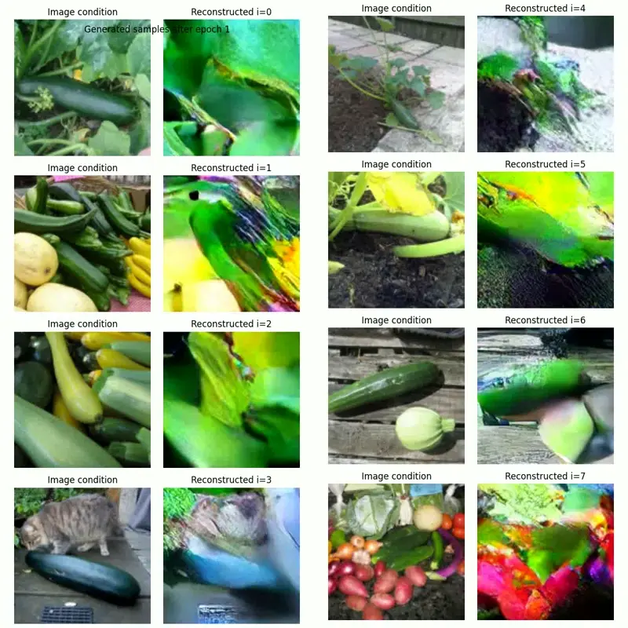
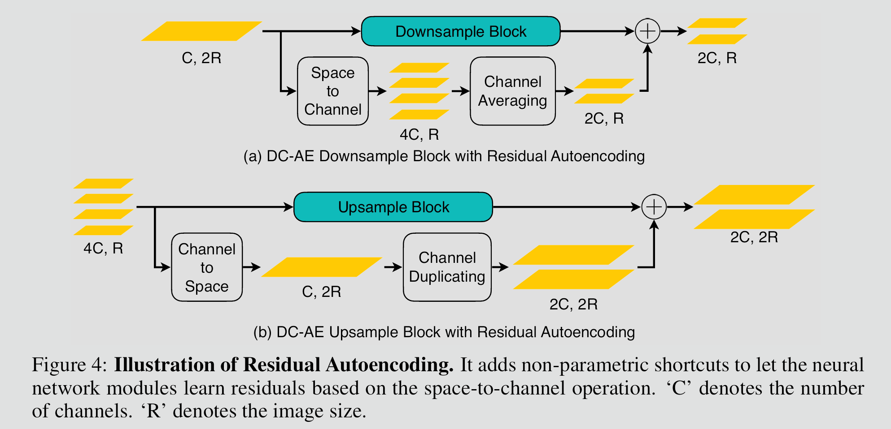
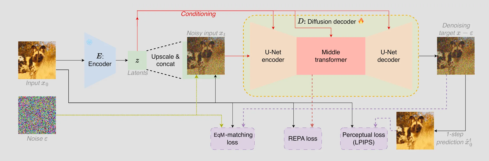
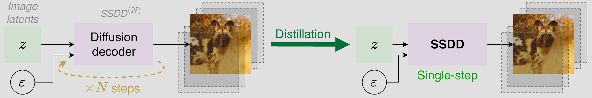
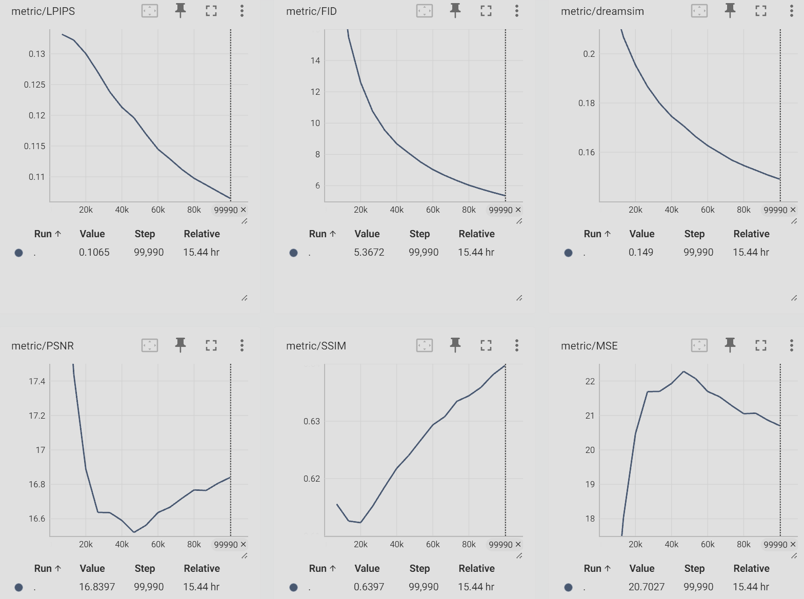
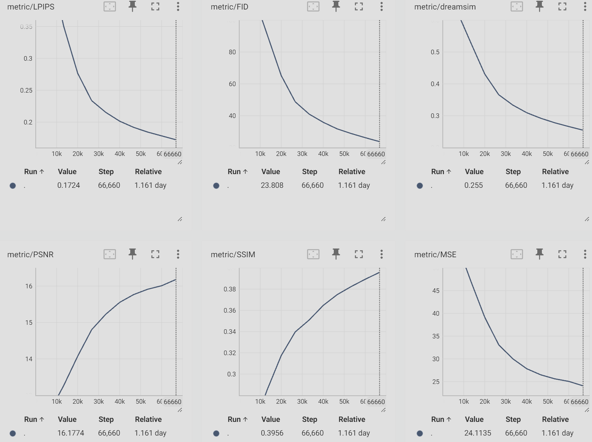
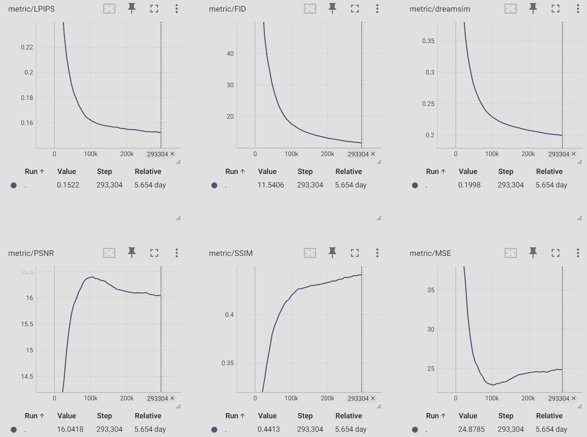

### Abstract

We introduce DC-SSDAE, a novel autoencoder framework for efficient high-resolution image generation. By integrating a deep compression encoder for high-ratio spatial reduction, a single-step diffusion decoder for fast reconstruction, and equilibrium matching for stable generative training, DC-SSDAE achieves compact latent representations while preserving perceptual quality. Trained on ImageNet-1K, it replaces flow matching with a time-invariant equilibrium gradient, enabling flexible gradient-descent sampling. This combination addresses optimization challenges in high-compression settings, offering potential speedups in diffusion model pipelines without adversarial losses. The purpose of this project is to prove this architecture can work well among s-o-t-a VAE models, and offers a strong & stable codebase for other VAE researchers to build upon.

Entire codebase is available at:  
<https://github.com/MrForExample/DC_SSDAE>

Experimental results is available at:  
<https://huggingface.co/MrForExample/DC-SSDAE>

### 1. Introduction

High-resolution generative models, such as diffusion transformers, face computational bottlenecks due to quadratic token complexity. Autoencoders mitigate this by compressing images into latent tokens, but traditional variants like KL-VAE struggle with high compression ratios and multi-step decoding. Recent works have advanced encoder compression and diffusion-based decoders, yet they often rely on time-dependent losses like flow matching, which limit sampling flexibility.

DC-SSDAE unifies these ideas: it adopts a residual-based deep compression encoder to achieve up to 128× spatial reduction, a hybrid U-Net-transformer decoder for single-step efficiency, and equilibrium matching to learn an implicit energy landscape for gradient-based inference. This design enables drop-in replacement in generative pipelines, focusing on ImageNet-1K for evaluation. By discarding time conditioning, DC-SSDAE promotes stable training and adaptive sampling, potentially reducing function evaluations by 60% compared to flow-based alternatives.

### 2. Related Work

Autoencoders for diffusion models have evolved from VQ-VAE's discrete tokens to continuous KL-regularized variants, enabling end-to-end training but with limited compression. [The Deep Compression Autoencoder (DC-AE)](https://hanlab.mit.edu/projects/dc-ae) introduces residual shortcuts and decoupled high-resolution adaptation to handle up to 128× compression, using space-to-channel transformations and three-phase training for optimization stability.

Diffusion decoders, as in [Single-Step Diffusion Decoder (SSDD)](https://arxiv.org/abs/2510.04961), replace Gaussian decoders with U-ViT architectures conditioned via AdaGN, trained on flow matching, LPIPS, and REPA losses for GAN-free reconstruction. Single-step distillation further accelerates inference, achieving 3.8× speedup over KL-VAE.

Generative losses like flow matching learn velocity fields along linear paths, but [Equilibrium Matching (EqM)](https://raywang4.github.io/equilibrium_matching) shifts to time-invariant gradients over implicit energies, supporting optimization-based sampling via gradient descent. EqM's conservative field ensures data as local minima, offering theoretical convergence guarantees.

DC-SSDAE synthesizes these: DC-AE's encoder for compression, SSDD's decoder and objectives (minus flow matching), and EqM for loss and sampling.

### 3. Method

### 3.1 Architecture

DC-SSDAE comprises an encoder for deep compression and a decoder for single-step diffusion reconstruction.

- **Encoder**: Based on DC-AE, it uses residual autoencoding with non-parametric space-to-channel shortcuts to learn residuals, alleviating high-compression optimization issues. The structure includes EfficientViT blocks in middle stages for high-resolution handling, downsample blocks with ResNet, and compression ratios of f32 (32x, latent 16x16xc), f64 (64×, latent 8×8×c) or f128 (128×, 4×4×c). Inputs are downsampled from 512×512 to compact latents $z ∈ ℝ^{c × H/f × W/f}$.

    

- **Decoder**: Adopted from SSDD, it employs a hybrid U-ViT: four convolutional ResNet levels with down/upsampling, and a middle transformer on 8×8 patches. Conditioning integrates upsampled z via a separate conv head then feature map concatenation to cope the fact that channel size of z could be way larger than 3 image channels. Adaptive group-normalization (AdaGN) in conv blocks, and AdaLN in the transformer. GEGLU activations and relative positional embeddings with 17×17 windows ensure scalability (e.g., SSDD-M with 48M params).

    

This pairing enables efficient tokenization: encoder compresses aggressively, decoder reconstructs in one step post-distillation.

### 3.2 Training Objectives

We adapt SSDD's GAN-free objectives, replacing flow matching with equilibrium matching for equilibrium dynamics.

- **Equilibrium Matching Loss (L_EqM)**: Learns a time-invariant gradient f(x) matching an implicit energy ∇E(x). For corrupted x_γ = γx + (1-γ)ε (γ uniform [0,1], not conditioned), L_EqM = E[ ||f(x_γ) - (ε - x) c(γ)||² ], with c(γ) = 1 - γ (linear decay) ensuring zero gradient at data. A multiplier λ scales targets.
- **Perceptual Loss (L_LPIPS)**: Aligns reconstructions with LPIPS: L_LPIPS = LPIPS(x, x̂), where x̂ = x_γ + f(x_γ) (one-step prediction).
- **REPA Loss (L_REPA)**: Aligns transformer tokens with DINOv2 features via MLP for stability.
- **KL Loss (L_KL)**: To encourages a structured latent space

Final loss: L = L_EqM + 0.5 L_LPIPS + 0.25 L_REPA + 1e6 L_KL

Training follows a decoupled strategy: Phase 1 on low-res (256×256) with reconstruction; Phase 2 adapts latents for high-res; Phase 3 refines decoder head with EqM on low-res.

### 3.3 Single-Step Distillation and Sampling

Distill multi-step EqM behavior into single-step: Teacher (e.g., 8 steps) generates targets; student matches in one forward pass using EqM and LPIPS.

Sampling uses gradient descent: $x_{k+1} = x_k - η f(x_k)$, or Nesterov acceleration for faster convergence. Adaptive stopping when ||f(x)|| < ε reduces steps.

### 4. Experiments

Since our goal here is not to train a s-o-t-a VAE but to prove this system architecture could work well given sufficient GPUs time. So, given a limited budget < 3k USD, we evaluate DC-SSDAE on ImageNet-1K, a standard 1.28M-image dataset with 1000 classes, at 256×256 and 512×512 resolutions. Models trained are using vq_f8c4_FM, dc_f32c32_FM, and dc_f32c32_EqM configurations where vq_f8_c4 & dc_f32c32 encoders have 32.6M and 217.4M parameters respectively, all 3 models share the same decoder architecture which has 13.5M parameters, all models are trained on 8 RTX4090GPUs with batch size 192.

**vq_f8c4_FM:**

**dc_f32c32_FM:**

**dc_f32c32_EqM:**

As you can see from the evaluation graphs above (From TensorBoard with curve smoothness of 0), models shows strong converge trend and stable training curve, especially dc_f32c32_EqM even after 45 epochs.

### 5. Future works

It should be obvious that replacing standard f8 encoder with f32, f64 and even f128 encoders to generate much smaller number of tokens is a bit low hanging fruit to massively increase the throughput (thus training & inference speed) and decrease memory consumption, e.g., (Image/Video Diffusion model, VLMs, Deepseek-ocr, etc.)
